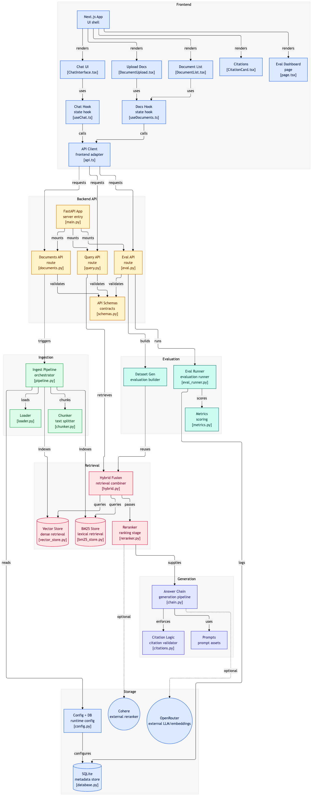

# RAG System — Ask My Docs

Production-grade Retrieval-Augmented Generation app. Upload documents, ask questions, get grounded answers with verified source citations.

## Architecture

```text
User
  |
  v
Vercel Frontend (Next.js)
  |
  v
Render Backend (FastAPI)
  |--------> OpenRouter (LLM + embeddings)
  |--------> Cohere (reranking)
  |
  +--------> ChromaDB persistent disk
  +--------> BM25 JSON corpus
  +--------> SQLite metadata + eval logs
```



## Quick Start (Local)

```bash
cp .env.example .env
# fill OPENROUTER_API_KEY + COHERE_API_KEY

cd backend
pip install -r requirements.txt
uvicorn main:app --reload

cd ../frontend
npm install
npm run dev
```

Open `http://localhost:3000`.

## Deploy to Production

### Backend → Render

1. Push repo to GitHub.
2. `render.com` → New → Blueprint → connect repo → detect `render.yaml`.
3. In Render dashboard → `rag-backend` → Environment → add `OPENROUTER_API_KEY` + `COHERE_API_KEY`.
4. Copy Render URL, for example `https://rag-backend.onrender.com`.

### Frontend → Vercel

1. `vercel.com` → New Project → import repo.
2. Set `NEXT_PUBLIC_API_URL = https://rag-backend.onrender.com`.
3. Deploy.

## Using the System

1. Upload PDFs/docs via the UI drag-drop zone.
2. Wait for ready status.
3. Ask questions in chat. Answers include source citations.
4. `POST /eval/generate` auto-builds evaluation dataset from your docs.
5. `POST /eval/run` or visit `/eval` to see quality scores.

## Evaluation

System auto-generates a 50-QA golden dataset using RAGAS TestsetGenerator from your documents.
No manual QA pairs needed. Re-generate any time by calling `POST /eval/generate`.
CI runs eval on every push to `main`. Build fails if faithfulness `< 0.80` or answer relevancy `< 0.75`.

## API Keys

Default local mode does not spend API credits. It uses local hash embeddings, lexical reranking, and extractive cited answers.

Remote model mode is optional:

- `OPENROUTER_API_KEY`: LLM inference and embeddings via OpenRouter.
- `COHERE_API_KEY`: reranking via Cohere.

Set `USE_REMOTE_MODELS=true` only when you want remote paid models. Keep `USE_REMOTE_MODELS=false` for free local usage.

No keys are needed for ChromaDB, SQLite, BM25, Render deploy setup, or Vercel deploy setup.

## Local Checks

```bash
OPENROUTER_API_KEY=test COHERE_API_KEY=test pytest backend/tests -q
cd frontend && npm run build
```

## Decisions Made

- Built PRD top-level `rag-system/` contents directly in this workspace root (`HybridRAG`) because this directory is the active repo root.
- Added `frontend/next.config.mjs` as a runtime mirror of required `frontend/next.config.ts`. Next.js 14.2.35 does not load `next.config.ts`, while the PRD requires both Next.js 14 and a `next.config.ts` file. Keeping both preserves the specified file and makes production builds pass.
- Added `frontend/postcss.config.mjs` and `frontend/next-env.d.ts` because Next.js + Tailwind TypeScript builds need them.
